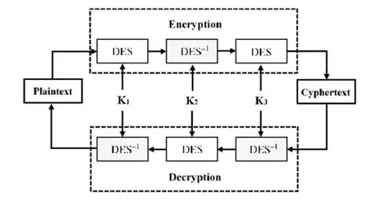
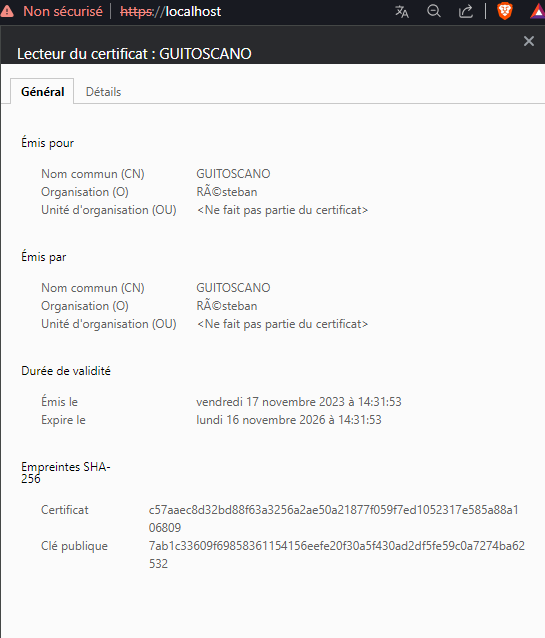

# Signature-et-certificats

<div id="gif" style="display: flex;">
  
  
</div>
Ce dépôt est la trace de nos recherches sur les signatures et certificats en cryptographie.

## Sujet

"Après vous être remis à jour en cryptogtaphie, vous présenterez comment signer numériquement un document et comment vérifier que la signature numérique est bien celle de l’entité cible.

Pour un site web il s’agit d’un certificat SSL et le standard le plus utilisé pour la création des certificats numériques est le X.509. Vous aborderez les architectures PKI avec les préconisations du Référentiel Général de Sécurité (RGS)."

## Sommaire

- [Signatures](#signatures)
  - [Générer votre paire de clés RSA](#générer-votre-paire-de-clés-rsa)
  - [Signer numériquement un fichier](#signer-numériquement-un-fichier)
  - [Vérifier que la signature est celle de l'entité cible](#vérifier-que-la-signature-est-celle-de-lentité-cible)

- [Certificats](#certificats)
  - [Généreration d'un certificat autosigné](#génération-dun-certificat-autosigné)
  - [Faire certifier sa clé publique](#faire-certifier-sa-clé-publique)
  
- [Sources](#sources)

## Signatures

Petit rappel : La signature numérique est un mécanisme permettant d'authentifier l'auteur d'un document électronique et d'en garantir la non-répudiation (ne peut être remis en cause par l'une des parties), par analogie avec la signature manuscrite d'un document papier

Pourquoi opter pour la signature numérique ? 

Elle présente plusieurs avantages à la signature manuscrite : 
- Gain de temps
- Facilité
- Économies (gain du temps passé, gain d'impression, pas d'envoi postal...)
- Fiabilité (robustesse des algos, on est sûr de l'identité de la personne cible)

Pour signer un document, il nous faut générer une paire de clés RSA : 

### Générer votre paire de clés RSA

#### Comment ça marche ?

RSA, illustration très simplifiée :
Tout d'abord calcul de la paire de clefs :

Choix des facteurs `p` = 79 et `q` = 127 (il faut choisir des nombres premiers assez grands, pour l'exemple ils sont très petits)

`n` = `p` * `q` = 79 * 127 = 10033 (`n` = modulo).

(`p` - 1) * (`q` - 1) = 78 * 126 = 9828 (`phi`)

Choix d'un nombre dont le PGCD avec 9828 (`phi`) soit égal à 1 (en somme, un nombre premier avec `phi`) : parmi les valeurs possibles on choisit (par exemple) `a` = 97 (clé privée).

Calcul de la clé publique `b`, tel que b vérifie cette égalite :

(`a` * `b`) % 9828 = 1 (`b` est l'inverse modulaire de `a` par rapport à 9828 (`phi`)), `b` = 2533 dans notre cas.

Nous allons désormais le faire à l'aide d'OpenSSL.

-------------

Nous allons générer notre paire de clés RSA (privée & publique) avec OpenSSL 
(déjà installé sous les distributions Linux, il faut l'installer sous Windows), 
qui vont nous permettre d'effectuer les différentes actions de signature et de certificats.

```
openssl genrsa -out key 4096
```

Ici, on utilise la commande genrsa pour générer une paire de clés RSA.
On spécifie le nom du fichier de sortie dans la paire de clés générée
sera enregistrée.
On spécifie enfin la longueur de la clé RSA en bits, plus la clé est longue plus elle est sécurisée.

En regardant les détails de notre clé privée (openssl rsa -text -in `key`), on trouve ces valeurs : 

`p` (prime1) = 28801848262248049197762633695084565880881233586722034388395275688832434177661677266999925272974178258205011741647898468962326982072652597906022921015943611739007075659157122343510043485770825501079475657875554060522048241398249168825541398970171625917779876200980011561625469723364430589314730540176108455964011383829066803158680944133637867675390766727415130877794378213700515190554113046365211078218257737887705898899773793821168448769958842554019183910178836009446478195439556968970064694317822567132066871889116110557940210750606949464175004967412850865586739080994336557019361582284697467688337957289807759358019

`q` (prime2) = 27169970559125643370877856079755629964904825848552574102394707059866977332153991230937679590591201854798799238018530463186920897922528806245476160205117215167690183239494877099772975846290908425373554822139374459943537770456697335704000271298954327049589341123652974657831205620282820427373842691493337442152355335095336434139146207840227079784812472449239559675183248871887687647691663227673839619346675809931901030724525725009324242045460346703839936924252533162122516560693746526774651501021233033504199581066792621253385206371315972233927312769309427295522960627354403280933536628621685931054854185588648260713661

`n` (modulus) = 782545369333683569161575692448095307542108608775527483716579237517628890688447932325390090872207747891855547467914133160764737008239688654894079067665329108007274872388501437557599229865761038085689060222475367954372147181954735569401397154354372774333502277397471295720784315303580577715910704127895541297963142860880785391929552904661418135532700673207134822987037263930569822818996636293809232263040653204414906901849407896584032228975279736913455834916076120448092018407379877686395268252280683296728261705158959323374743021293159371315310506106050794334268669822910015438719200794955196464000512392828991572242457529093068625590500343075158639254744810118048327659209304736107014237400401712964602265725727562263925448217753717047941664300494004494690233438187022757032336119349019667738235764461124162274134868037993613214060256276838698911178206050108507898150373016628578079040444835201668107517081737084148245847614699050291858142994592825815620338602598350679992202060846039486797729571032436388046518185293620308486123692191450699263757937294070143028441174698612977795514179833822407387558147094092446477831590877399864794508233814941091568567915609652954515968930271622304065329083515169058115475863677513096748143197559

`phi` = 782545369333683569161575692448095307542108608775527483716579237517628890688447932325390090872207747891855547467914133160764737008239688654894079067665329108007274872388501437557599229865761038085689060222475367954372147181954735569401397154354372774333502277397471295720784315303580577715910704127895541297963142860880785391929552904661418135532700673207134822987037263930569822818996636293809232263040653204414906901849407896584032228975279736913455834916076120448092018407379877686395268252280683296728261705158959323374743021293159371315310506106050794334268669822910015438719200794955196464000512392828991572242401557274247251897931702585383799058899024058613053050718514753358314825890586044466664660862162182150921637238087288115792416420498823090538734356965961930125638860450367668294952745129062428347681837557978684693594670264983752406648664379839381945183003799303945092820988159858020856500393163852478799949498332331367454905696765673841755391142395111503337511507868412401209526732786660114007467487728686760666516762567151180433265246478650953770582053864181608623945185077689103891813430898753390877195324424443956062696908397819168646869813291916232237807820571913955325491130616958151732077120485370218292123125880

`a` (privateExponent) = 304936808856731479763314158929146252712366596745493704001617415623620345917597438023190139016043478732047652032219832043877654664028337715621480861651237846716965770344348226381219297989102421389937397500062193063746523257591284876808106573811770021681324765554978438898902754844177194465857875124253419193240196261366457075226161131562984212662070430327354152760165366834900775671018449084811635771145035652140743281801580463905320888407627659509831623542224269710291498940868018315686747343130507805237443694803691093585977192697021591233202613866004321005059024519545843939667835724881605921809742366725159631535261775327978490302720292668653302109742027807328076488231829802573578955759247240544878192610249138773063105906377667026276862391423149428356168240966121973412706794912514907806529185118421598412241920862347370946259680626625495048003320123477396525872156965174239739085743864175261861746906947502397174010258150526854480116295893949655473231594282410814840980955611998045410819746126702870005076593399380540670178755244211771150719866099635138279035117438751696309539834544059452449595364424559624276695823659176491904254904049063978041469113506095133113952974987648787571942452258966343881071539786004617769263780593

`b` (publicExponent) = 65537

L'exposant public est 65537 pour des raisons historique, car les premières implémentations de RSA n'utilisaient pas
correctement le "padding" (rembourrage) pour assurer la sécurité avec un petit exposant, et un trop grand exposant demandait trop de
performances pour une sécurité équivalente.

Ensuite, on chiffre notre paire de clé, et on renseigne un mot de passe : 

```
openssl rsa -in key -des3 -out key_enc
```

Plus de précision :
- "des3" -> DES-EDE3-CBC
- DES = Data Encryption Standard
- EDE3 = Encryption Decryption Encryption with 3 keys
- CBC = Cipher Block Chaining

Fonctionnement de des3 :



DES-EDE3-CBC (des3) est un algorithme de chiffrement symétrique par bloc, voici comment OpenSSL génère un hash du mot de passe : 

- Choix d'un Sel (Salt) : OpenSSL génère un sel aléatoire pour renforcer la sécurité du processus. Le sel est utilisé pour rendre le processus de chiffrement aléatoire, ce qui signifie que si on chiffre la même clé privée avec le même mot de passe plusieurs fois, on obtiendra des résultats différents en raison du sel.


- Chiffrement de la Clé Privée : OpenSSL utilise le mot de passe (et éventuellement le sel) pour dériver une clé à partir du mot de passe en utilisant un algorithme de dérivation de clé. Ensuite, cette clé dérivée est utilisée pour chiffrer la clé privée RSA à l'aide de DES3.


- La clé dérivée elle-même n'est pas directement le hash du mot de passe, mais plutôt une clé symétrique qui est utilisée pour chiffrer et déchiffrer la clé privée.


##### Le choix de l'algorithme de dérivation de clé et la gestion du sel sont importants pour la sécurité de cette opération. OpenSSL utilise généralement une forme de dérivation de clé sécurisée, telle que PBKDF2, pour rendre le processus résistant aux attaques par force brute. 

------------------------

On exporte ensuite la partie publique de la clé, en renseignant notre mot de passe : 

```
openssl rsa -in key_enc -pubout -out key.pub
```

On se retrouve avec deux fichiers, l'un contenant la clé privée (key_enc) et l'autre la clé publique (key.pub).

### Signer numériquement un fichier

Pour signer un fichier, on calcule d’abord son empreinte. 
La commande dgst permet de le faire 
(dgst = digest, une représentation numérique d’un message calculé par un algorithme de hachage cryptographique ou une fonction).

```
openssl dgst -sha256 -out hash file
```

Ici, nous avons récupéré le hash du fichier `file` dans le fichier de sortie nommé `hash`.
Nous allons maintenant signer le fichier.

```
openssl pkeyutl -sign -in hash -inkey key_enc -out signature
```

Ici, on utilise la commande pkeyutl d'OpenSSL, 
qui permet d'effectuer diverses opérations sur une clé privée ou publique, 
y compris la signature numérique comme ici.
Ensuite, plusieurs options sont définies : 

- -sign :  Cette option indique à OpenSSL d'effectuer une opération de signature. 
           Dans ce contexte, cela signifie qu'elle va utiliser la clé privée spécifiée pour signer les données d'entrée.


- -in hash : Spécifie le fichier d'entrée contenant la valeur du hash des données que nous souhaitons signer. 
             La signature numérique est générée à partir de ce hachage.


- -inkey key_enc : Spécifie le fichier contenant la clé privée utilisée pour signer les données (clé.


- -out signature : Spécifie le fichier de sortie


### Vérifier que la signature est celle de l'entité cible

```
openssl pkeyutl -verify -sigfile signature -in hash -pubin -inkey key.pub
```

Si le fichier a été bien signé, on aura d'affiché dans le terminal : `Signature Verified Successfully`, 
sinon `Signature Verification Failure`.

Voici les options de cette commande : 

- -verify : Cette option indique à OpenSSL d'effectuer une opération de vérification de signature.


- -sigfile signature : Le fichier contenant le hash de la signature.


- -in hash : Le hash de la signature calculé auparavant.


- -pubin -inkey key.pub : On précise la clé à utiliser, ici la clé publique de la personne ayant signé le fichier.
-pubin permet de dire à OpenSSL que nous allons renseigner une clé publique, si nous mettons simplement -inkey key.pub, il va vouloir une clé privée.

## Certificats

Un certificat peut être vu comme une carte d'identité numérique.
Il est utilisé principalement pour identifier et authentifier une personne physique ou morale, mais aussi pour chiffrer des échanges.
Il est signé par un tiers de confiance (une autorité de certification) qui atteste du lien entre l’identité physique (vous, un site web...) et l’entité numérique (votre clé publique, celle du site web...).
Pour un site web il s’agit d’un certificat SSL. Le standard le plus utilisé pour la création des certificats numériques est le X.509.

### Génération d'un certificat autosigné

Pour pouvoir générer un certificat d’autorité de certification sans passer par une certification externe, on utilise :

```
openssl req -new -x509 -key key_enc -out CA.crt -days 1095
```

- req : Cette sous-commande est utilisée pour générer ou traiter des requêtes de certificat X.509.

- -new: Cette option indique que l'on veut créer une nouvelle requête de certificat.

- -x509: Cette option indique que l'on veut générer un certificat auto-signé plutôt qu'une demande de signature de certificat (CSR).

- -key key_enc : Notre clé privée.

- -out ca.crt : Notre fichier de sortie qui sera le certificat.

- -days 1095: Cette option spécifie la durée de validité du certificat en jours. Dans cet exemple, le certificat sera valide pendant 1095 jours (environ 3 ans).

Nous pouvons visualiser le certificat avec cette commande : 

```
openssl x509 -text -in CA.crt
```
Nous devons remplir plusieurs champs, le code de notre pays, le département ou l'état , la ville, le nom de l'organisation,
la section de l'organisation, notre nom, et notre e-mail.


Nous avons accès à plusieurs informations, celles renseignées auparavant, et notre clé publique, la période de validité du certificat, l'algorithme de signature utilisé, notre signature en hexa...


On peut voir la période de validité de notre certificat avec cette commande : 

```
openssl x509 -noout -in CA.crt -dates
```

Nous avons ici créé un serveur web nginx en local, et nous lui avons attribué notre certificat créé précédemment (CA.crt). Voici les lignes ajoutées dans le fichier nginx.conf, dans la clause http :

```
server {
    listen 443 ssl;
    ssl_certificate /etc/ssl/CA.crt;
    ssl_certificate_key /etc/ssl/key;
}
```


### Faire certifier sa clé publique
Pour 'monter en grade dans les certifications', nous devons faire certifier notre clé publique par un tiers de confiance. Par exemple, les gros sites web comme Apple, Amazon, Fnac... doivent avoir un certificat plus 'solide' qu'un simple certificat autosigné.
Dans cet exemple, nous allons créer une demande de certificat, puis la soumettre à une CA (autorité de certification), qui sera dans notre cas le certificat créé dans la partie précédente.

Nous allons dans un premier temps créer une requête de certificat : 

```
openssl req -new -key key_enc -out request
```

Ensuite, nous allons contacter une CA qui nous délivrera un certificat signé, après avoir procédé (normalement) à quelques vérifications nous concernant... 
Nous allons à présent jouer le rôle de la CA qui voit arriver une requête d’un tiers voulant certifier sa clé publique.

```
openssl x509 -days 90 -CA CA.crt -CAkey key_enc -in request -req -out CA.crt
```

- -CA CA.crt : Le certificat de la CA (dans notre cas, c'est le certificat que nous avons généré à la partie précédente).

- -CAkey key_enc : C'est la clé privée de la CA qui a servi à créer le certificat de la CA.

- -in request : C'est la requête de la personne ayant voulu faire certifier sa clé publique

- -req : On indique ici que le fichier en entrée est une demande de certificat (requête).

- -out certificat2.crt : Le certificat créé et signé par la CA.

On peut vérifier avec cette commande que `certificat` a été crée et signé par `CA`, celui de la CA.

```
openssl verify -CAfile CA.crt certificate.crt
```

## Sources

TP de Rémi Boulle : [TP9-TP10-signature-certificat-openSSL-prof.html](resources/TP9-TP10-signature-certificat-openSSL-prof.html)

https://lig-membres.imag.fr/prost/M1_MEEF_NSI/openssl.html

http://www.iut-fbleau.fr/sitebp/asr/asr42/openssl/

Documentation de OpenSSL : https://www.openssl.org/docs/man3.0/man1/openssl-dgst.html

http://www.dg77.net/tekno/securite/pubkey.htm

# TODO

#### faire serveur prototype et tester les certificat

#### faire serveur prototype et tester les certificat
